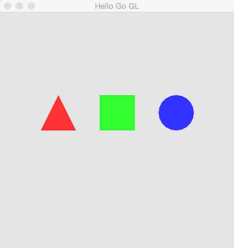

helloGoGL
=================

Playing with OpenGL using Go



Getting the Project 
-------------------

```bash
go get github.com/mpiannucci/helloGoGL
```

**NOTE** This project uses [go-gl](https://github.com/go-gl/gl) as its OpenGL bindings. This requires `gcc` to be installed. On Windows, install [Mingw-w64](http://mingw-w64.sourceforge.net/) and add the `bin` directory to your path to obtain `gcc`. 

Running the App
-------------------

```bash 
cd $GOPATH/src/github.com/mpiannucci/helloGoGL/
go run main.go
```