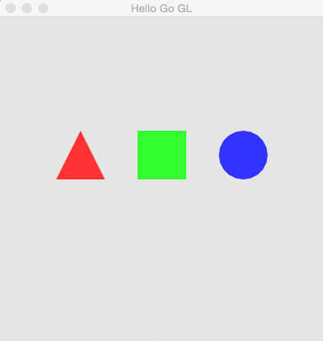

helloGoGL
=================

Playing with OpenGL using Go



Installing Dependencies
------------------
This program uses [Go-GL](https://github.com/go-gl/gl) to bind with OpenGL. This requires GLEW and GLFW3 to be installed. 

### Ubuntu

```bash
sudo apt-get update
sudo apt-get install libglew-dev lib-glfw3-dev libxrandr-dev
```

### OSX 

```bash 
brew install glew glfw
```

However, this is a non-standard location to install the libraries, so we must tell the CGo linker where to find them. 

```bash
go get github.com/go-gl/gl
cd $GOHOME/src/github.com/go-gl/gl
CGO_CFLAGS="-I/path/to/includes" CGO_LDFLAGS="-L/path/to/libs" go install
```
*There may be steps missing from this*

Getting the Project 
-------------------

```bash
go get github.com/mpiannucci/helloGoGL
```

Running the App
-------------------

```bash 
cd $GOPATH/src/github.com/mpiannucci/helloGoGL/
go run main.go
```